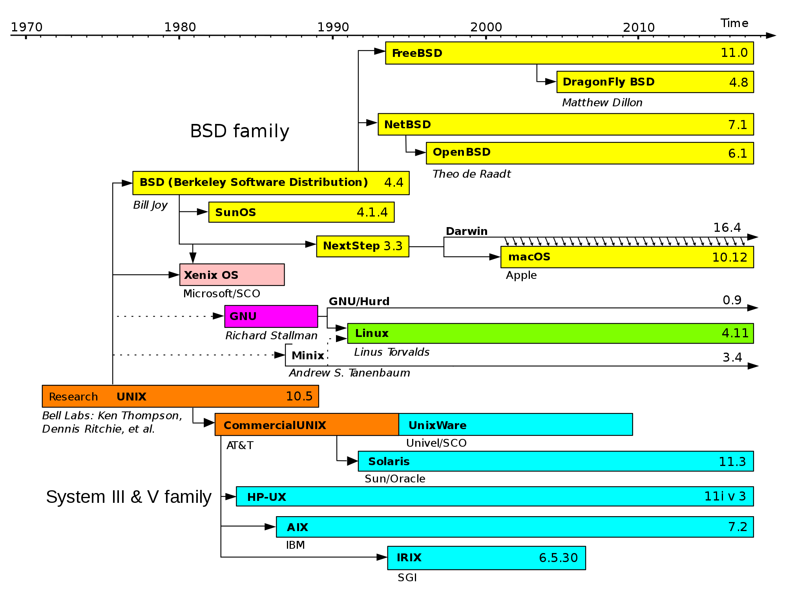

% Beginners' Guide to the Terminal
% [{.logo-img style="height: 5ex;"}](https://nushackers.org){target="_blank"}
% September 10 2024

---

## Slides

hckr.cc/ht-terminal-slides

---

## About Me

Hi! I'm Chun Yu. I'm a Year 4 Computer Science Undergrad who loves hacking and building systems.

---

## Overview

By the end of this session, you should be able to:

* *Not* get confused when you see a terminal with a blinking cursor
* *Not* blinding copy and paste magical commands without knowing what they do
* Be **somewhat** productive with a terminal

---

## Required Software

* If you're on macOS or Linux, you should be all set!
* If you're on Windows, you should try using WSL, it's pretty decent!

Open up a powershell as administrator and run:
```
wsl --install
```

---

## What is Unix?

* tldr: very old operating systems that modern OSes take inspiration from



---


